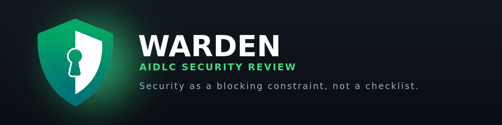
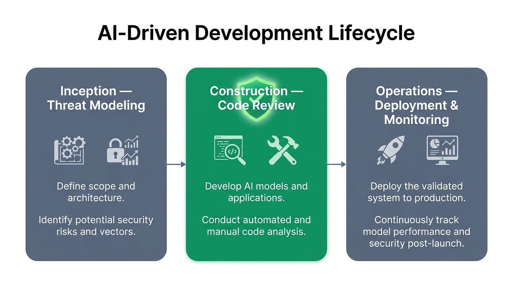
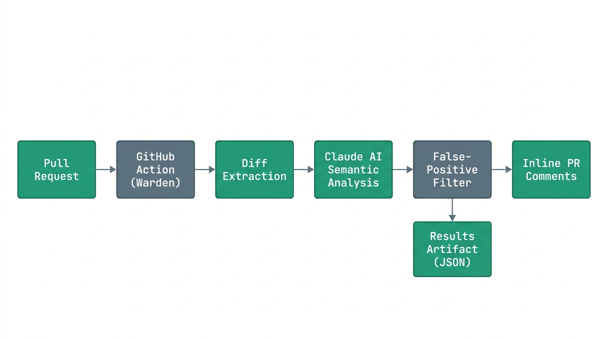
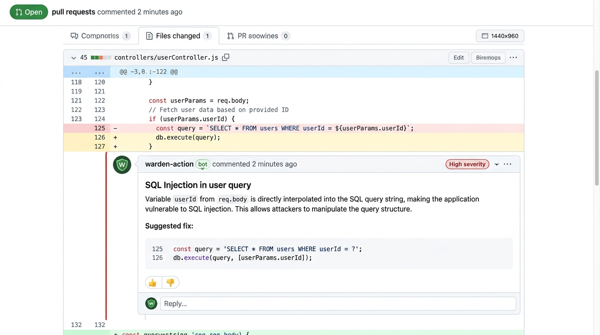

<div align="center">


# Warden — AIDLC Security Review

**Security as a blocking constraint, not a checklist.**

An AI-powered security review GitHub Action that analyzes code changes for vulnerabilities using Anthropic's Claude for deep, context-aware semantic analysis. The code-review pillar of **Warden**, the AI-Driven Development Lifecycle (AIDLC) security platform by [Techanv Consulting](https://techanv.com/).

[](LICENSE)
[](https://www.anthropic.com/claude)
[](https://github.com/techanvconsulting/warden-action)
[](https://warden.techanv.com)



</div>

---

## Table of Contents

- [Overview](#overview)
- [Where Warden Fits](#where-warden-fits)
- [Features](#features)
- [Quick Start](#quick-start)
- [How It Works](#how-it-works)
- [Example Output](#example-output)
- [Configuration](#configuration)
- [Security Analysis Capabilities](#security-analysis-capabilities)
- [Claude Code Integration: /security-review](#claude-code-integration-security-review-command)
- [Custom Scanning Configuration](#custom-scanning-configuration)
- [Local Development & Testing](#local-development--testing)
- [Security Considerations](#security-considerations)
- [License & Attribution](#license--attribution)
- [Support](#support)

---

## Overview

**Warden** integrates security directly into AI-assisted development. Rather than treating security as an afterthought checklist, Warden bakes protective guardrails into every stage of AI-powered coding — preventing violations from proceeding without human review.

This repository is the **code-review pillar**: a GitHub Action that runs on pull requests, uses Claude to understand *what changed and why*, and surfaces real, high-impact security findings as inline PR comments.

> **Note:** Warden calls the Anthropic Claude API under the hood. References to the `anthropic` SDK, the `ANTHROPIC_API_KEY` environment variable, the `@anthropic-ai/claude-code` CLI, and `claude-*` model IDs are **functional** and intentionally preserved.

## Where Warden Fits

Warden enforces security across the three phases of the AI-Driven Development Lifecycle (AIDLC):

<div align="center">

</div>

| Phase | Focus | This Action |
|-------|-------|-------------|
| **Inception** | Threat modeling | — |
| **Construction** | Code review | ✅ **You are here** |
| **Operations** | Deployment & monitoring | — |

## Features

- **AI-Powered Analysis** — Claude's reasoning detects vulnerabilities with deep semantic understanding, not just pattern matching.
- **Diff-Aware Scanning** — For PRs, only analyzes changed files.
- **Inline PR Comments** — Posts findings on the exact lines of code.
- **Contextual Understanding** — Understands code intent and purpose, reducing noise.
- **Language Agnostic** — Works with any programming language.
- **False-Positive Filtering** — Advanced filtering focuses attention on real, high-impact issues.

## Quick Start

Add this to your repository's `.github/workflows/security.yml`:

```yaml
name: Security Review

permissions:
  pull-requests: write  # Needed for leaving PR comments
  contents: read

on:
  pull_request:

jobs:
  security:
    runs-on: ubuntu-latest
    steps:
      - uses: actions/checkout@v4
        with:
          ref: ${{ github.event.pull_request.head.sha || github.sha }}
          fetch-depth: 2

      - uses: techanvconsulting/warden-action@main
        with:
          comment-pr: true
          claude-api-key: ${{ secrets.CLAUDE_API_KEY }}
```

Add your Anthropic Claude API key as the `CLAUDE_API_KEY` repository secret. The key must be enabled for both the Claude API and Claude Code usage.

## How It Works

<div align="center">

</div>

1. **PR Analysis** — When a pull request opens, Claude analyzes the diff to understand what changed.
2. **Contextual Review** — Claude examines the changes in context, understanding purpose and security implications.
3. **Finding Generation** — Issues are identified with explanations, severity ratings, and remediation guidance.
4. **False-Positive Filtering** — Low-impact and false-positive-prone findings are filtered out to reduce noise.
5. **PR Comments** — Findings are posted as review comments on the specific lines of code.

### Repository Layout

```
claudecode/
├── github_action_audit.py   # Main audit entrypoint for GitHub Actions
├── prompts.py               # Security audit prompt templates
├── findings_filter.py       # False-positive filtering logic
├── claude_api_client.py     # Claude API client for false-positive filtering
├── json_parser.py           # Robust JSON parsing utilities
├── requirements.txt         # Python dependencies
├── test_*.py                # Test suites
└── evals/                   # Eval tooling to test scans on arbitrary PRs
```

## Example Output

<div align="center">

</div>

## Configuration

### Action Inputs

| Input | Description | Default | Required |
|-------|-------------|---------|----------|
| `claude-api-key` | Anthropic Claude API key for security analysis. Must be enabled for both the Claude API and Claude Code usage. | None | Yes |
| `comment-pr` | Whether to comment on PRs with findings | `true` | No |
| `upload-results` | Whether to upload results as artifacts | `true` | No |
| `exclude-directories` | Comma-separated list of directories to exclude from scanning | None | No |
| `claude-model` | Claude [model name](https://docs.anthropic.com/en/docs/about-claude/models/overview#model-names) to use. Defaults to Opus 4.1. | `claude-opus-4-1-20250805` | No |
| `claudecode-timeout` | Timeout for analysis in minutes | `20` | No |
| `run-every-commit` | Run on every commit (skips cache check). May increase false positives on PRs with many commits. | `false` | No |
| `false-positive-filtering-instructions` | Path to custom false-positive filtering instructions file | None | No |
| `custom-security-scan-instructions` | Path to custom security scan instructions file to append to the audit prompt | None | No |

### Action Outputs

| Output | Description |
|--------|-------------|
| `findings-count` | Total number of security findings |
| `results-file` | Path to the results JSON file |

## Security Analysis Capabilities

### Vulnerability Categories Detected

- **Injection** — SQL, command, LDAP, XPath, NoSQL injection, XXE
- **Authentication & Authorization** — broken auth, privilege escalation, IDOR, bypass logic, session flaws
- **Data Exposure** — hardcoded secrets, sensitive data logging, information disclosure, PII handling
- **Cryptography** — weak algorithms, improper key management, insecure randomness
- **Input Validation** — missing validation, improper sanitization, buffer overflows
- **Business Logic** — race conditions, TOCTOU issues
- **Configuration** — insecure defaults, missing security headers, permissive CORS
- **Supply Chain** — vulnerable dependencies, typosquatting risks
- **Code Execution** — RCE via deserialization, pickle injection, eval injection
- **Cross-Site Scripting (XSS)** — reflected, stored, and DOM-based

### False-Positive Filtering

By default, low-impact and false-positive-prone findings are excluded to focus on high-impact issues:

- Denial-of-Service vulnerabilities
- Rate-limiting concerns
- Memory/CPU exhaustion
- Generic input validation without proven impact
- Open redirects

Filtering can be tuned per project — see [Custom Scanning Configuration](#custom-scanning-configuration).

### Benefits Over Traditional SAST

- **Contextual understanding** of semantics and intent, not just patterns
- **Lower false positives** through AI reasoning about actual exploitability
- **Detailed explanations** of why something is vulnerable and how to fix it
- **Adaptive** to organization-specific security requirements

## Claude Code Integration: /security-review Command

By default, Claude Code ships a `/security-review` [slash command](https://docs.anthropic.com/en/docs/claude-code/slash-commands) that provides the same analysis as this Action, integrated directly into your Claude Code environment. Run `/security-review` to perform a comprehensive review of all pending changes.

### Customizing the Command

1. Copy [`security-review.md`](https://github.com/techanvconsulting/warden-action/blob/main/.claude/commands/security-review.md?plain=1) into your project's `.claude/commands/` folder.
2. Edit it to add organization-specific scan or filtering directions.

## Custom Scanning Configuration

Custom scanning and false-positive filtering instructions are supported. See the [`docs/`](docs/) folder:

- [Custom security scan instructions](docs/custom-security-scan-instructions.md)
- [Custom false-positive filtering instructions](docs/custom-filtering-instructions.md)

## Local Development & Testing

Run the test suite:

```bash
cd warden-action
# Run all tests
pytest claudecode -v
```

To run the scanner locally against a specific PR, see the [evaluation framework documentation](claudecode/evals/README.md).

## Security Considerations

This Action is **not hardened against prompt injection** and should only review **trusted** PRs. Configure your repository to [require approval for all external contributors](https://docs.github.com/en/repositories/managing-your-repositorys-settings-and-features/enabling-features-for-your-repository/managing-github-actions-settings-for-a-repository#controlling-changes-from-forks-to-workflows-in-public-repositories) so workflows only run after a maintainer review.

## License & Attribution

Licensed under the **Apache License 2.0** — see [LICENSE](LICENSE) and [NOTICE](NOTICE).

Warden is a product of [Techanv Consulting](https://techanv.com/). It is a derivative of Anthropic's MIT-licensed [`claude-code-security-review`](https://github.com/anthropics/claude-code-security-review); the original MIT notice is retained in [NOTICE](NOTICE).

## Support

- Open an issue in this repository
- Visit [warden.techanv.com](https://warden.techanv.com)
- Check the [GitHub Actions logs](https://docs.github.com/en/actions/monitoring-and-troubleshooting-workflows/viewing-workflow-run-history) for debugging

---

<div align="center">
<sub>Built by <a href="https://techanv.com/">Techanv Consulting</a> · Powered by Anthropic Claude</sub>
</div>
